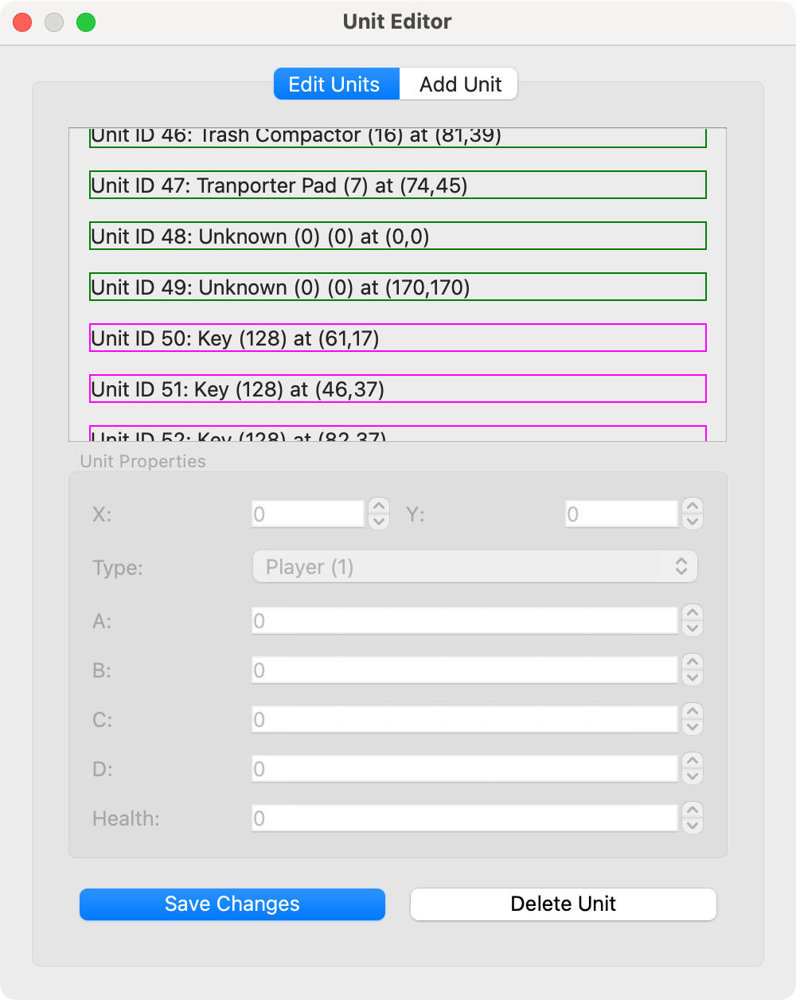

# Robots Map Editor

A PyQt5-based editor for editing tile-based maps, with support for animated tiles and various unit types. This application is designed for editing maps compatible with game engines like [PETSCII Robots](https://www.the8bitguy.com/25753/petscii-robot-shareware-available/).


## Features 

- Edit existing maps 
- Support for animated tiles (water, flags, etc.)
- Unit placement (player, robots, items)
- Binary map file format loading and saving
- Undo/redo functionality (for tiles, not for units)
- Keyboard shortcuts for navigation 

## Requirements

- Python 3.6+
- PyQt5

## Installation

1. Ensure you have Python (ver 3.x) installed
2. Create a virtual environment (`python3 -m venv...`)
3. In case of `venv`: `source /path-to-program/bin/activate`
4. Install PyQt5: `pip3 install PyQt5`
5. Clone or download this repository
6. Make a folder `tiles` in the same directory
7. Download tiles (`.png`) from: [https://github.com/zeropolis79/PETSCIIRobots-Amiga/tree/main/Amiga](https://github.com/zeropolis79/PETSCIIRobots-Amiga/tree/main/Amiga)
8. Copy the tiles in the folder `tiles`
9. Download levels from: [https://github.com/zeropolis79/PETSCIIRobots-Pet/tree/main](https://github.com/zeropolis79/PETSCIIRobots-Pet/tree/main) or from other level locations (see *Map Files*).
10. In case of `venv`: `source /path-to-program/bin/activate`
11. Editing `constants.py` may be required (refer to *Map Files* for details)
12. Run the application: `python3 main.py`

## Usage

### Basic Controls

- **Left-click**: Place the selected tile
- **Right-click**: Add unit 
- **Arrow keys**: Navigate around the map
- **Ctrl+Z**: Undo
- **Ctrl+Y**: Redo

### Interface Elements

- **Top-left panel**: Map view with grid
- **Top-right panel**: Tile palette for selection
- **Bottom-right panel**: Controls for loading/saving and options
- **Edit Units**:  Add or delete units and change their properties

### Show units

[Unit codes and parameters](https://www.the8bitguy.com/pr-mapedit/)

- P: Player ($\textcolor{blue}{\textrm{blue ■}}$)
- R: Robots ($\textcolor{red}{\textrm{red ■}}$)
- D: Doors and Transport ($\textcolor{green}{\textrm{green ■}}$)
- I: Items ($\textcolor{magenta}{\textrm{magenta ■}}$)

Example `R17-2`   : Robot with Unit ID 17, Type 2  
Example `D38-10-3`: Door with Unit ID 17, Type 10, needs Key 3

### Edit units

- Blue Frame ($\textcolor{blue}{\textrm{▭}}$): Player
- Red Frame ($\textcolor{red}{\textrm{▭}}$): Robots
- Green Frame ($\textcolor{green}{\textrm{▭}}$): Doors, Rafts, ... (Transport)
- Magenta Frame ($\textcolor{magenta}{\textrm{▭}}$): Items
- Grey Frame ($\textcolor{gray}{\textrm{▭}}$): Special, Unknown Type

- You should read the [Map Editor Instructions](https://www.the8bitguy.com/pr-mapedit/).
- The first two units (if present) are "special". Do not change them. Editable units always begin with the player unit. 
- In general, avoid changing units with a grey frame ($\textcolor{gray}{\textrm{▭}}$).
- If a unit slot is full (no unused Unit IDs), no other unit of the same type can be added. For example, if there are already 16 items, item 17 cannot be added.
- If there are empty slots (not used Unit IDs) in unit types, you can add a unit of the same type. For example, a raft in the "doors" type. Empty slots can be identified by *Unknown (0)....*
- It is also possible to delete a unit to free up a Unit ID.
- To add a unit at a specific position:
  1. Note a free Unit ID (check for *Unknown (0)...*).
  2. Close the Unit Editor.
  3. Right-click on the map.
  4. Add Unit.
  5. Insert the Unit ID.
  6. Change the type and properties.
  7. Save the changes.
  8. Save the map.
- To change properties of a unit:
  1. Select the unit in the Edit Units window
  2. Change the type (if you like). But it must be of the same kind, so replacing a robot with a robot is possible.
  3. Change the parameters. More ammo, more health or less...
  4. Save the changes.
  5. Save the map.
<div>   
  
  
</div>
  
### Map Files (Level)

- The application loads maps (levels) in a binary format compatible with PETSCII Robots.
- Slight differences in the level files across different systems or versions can be resolved by editing `constants.py`.
- **"IMPORTANT!"** Check the `MAP_DATA_OFFSET` in `constants.py`, as it can vary between versions (I found 770 and 514 for two versions of the X16 robots).
  In case of a mismatch, units — such as hidden objects or robots — may appear shifted, though the issue can be even more subtle.
- Check the console output of the program.  
Example output 1:
```
  Map size: 128x64
  Map data starts at offset: 770
  Expected map size: 8192 bytes
  Actual data after offset: 8192 bytes
```
two times `8192` bytes is okay.  

 Example output 2:
```
  Map size: 128x64
  Map data starts at offset: 770
  Expected map size: 8192 bytes
  Actual data after offset: 7936 bytes
```
 `8192` and `7936` bytes, `MAP_DATA_OFFSET` is probably wrong.
- Loading a level file and saving it without any edits should result in identical files.
- This can be verified using tools like [HexFiend](https://hexfiend.com), for example.
- There are two more important parameters in `constants.py`: `UNIT_BLOCK_SIZE` and `PLAYER_UNIT_ID`
- `PLAYER_UNIT_ID` can be obtained from the program output and is either `0` or `2`.  
- `UNIT_BLOCK_SIZE` is either `0x42` or `0x40`.  
- `FILL_VALUE` can be `0x00` or `0xAA` or different. It appears to depend on the level, but it is not yet clear whether this value is important.  
- **Warning:** Saving the level may corrupt or destroy it. Make a backup copy of the level before editing.

###### Commander X16 (Full Version) from 8-Bit Guy web site
```
UNIT_BLOCK_SIZE = 0x42
MAP_DATA_OFFSET = 770 - 128 - 128
PLAYER_UNIT_ID = 2 
```
###### PET
```
UNIT_BLOCK_SIZE = 0x42
MAP_DATA_OFFSET = 770
PLAYER_UNIT_ID = 2
```
###### MS-DOS
```
UNIT_BLOCK_SIZE = 0x40
MAP_DATA_OFFSET = 768
PLAYER_UNIT_ID = 0
```

### Map / Level Interoperability

Not really (yet). Loading and editing a level from the PET version likely won’t work correctly on the Amiga version due to differing map data offsets. 
You can experiment with `MAP_DATA_OFFSET_LOAD` and `MAP_DATA_OFFSET_SAVE` in `constants.py` to adjust for these differences, though this functionality hasn’t been thoroughly tested yet.

## Project Structure

The project is organized into several Python modules:

- **main.py**: The entry point that runs the application
- **tilemap_editor.py**: Main editor class that coordinates all components
- **map_data.py**: Classes for map data management and serialization
- **tile_manager.py**: Handles tile loading and organization
- **animation.py**: Manages tile animation states and timing
- **ui_components.py**: UI elements specific to this application
- **unit_editor.py**: Add or delete units, change properties
- **constants.py**: Shared constants and settings

## Directory Structure

```
tile-map-editor/
├── main.py               # Application entry point
├── tilemap_editor.py     # Main editor interface
├── map_data.py           # Map data handling
├── tile_manager.py       # Tileset management
├── animation.py          # Animation controller
├── ui_components.py      # UI widgets
├── constants.py          # Shared constants
├── unit_editor.py        # Unit editor
└── tiles/                # Directory for tile images
    └── animtiles.png     # Animated tile images
```

## Examples


