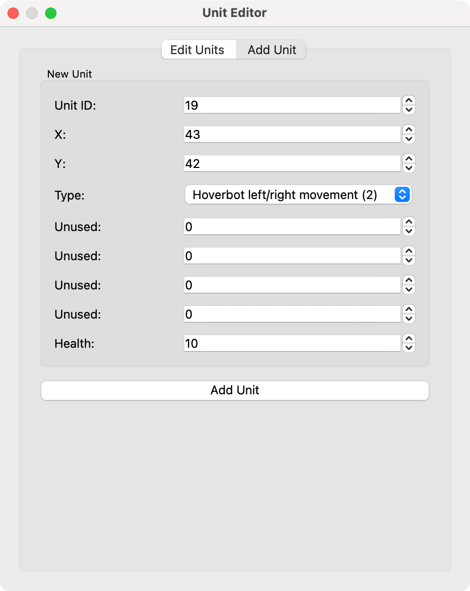

# Robots Map Editor

A PyQt5-based editor for editing tile-based maps, with support for animated tiles and various unit types. This application is designed for editing maps compatible with game engines like [PETSCII Robots](https://www.the8bitguy.com/25753/petscii-robot-shareware-available/).


## Features 

- Edit existing maps 
- Support for animated tiles (water, flags, etc.)
- Unit placement (player, robots, items)
- Binary map file format loading and saving
- Undo/redo functionality (for tiles, not for units)
- Keyboard shortcuts for navigation 

## Requirements

- Python 3.6+
- PyQt5

## Installation

1. Ensure you have Python (ver 3.x) installed
2. Create a virtual environment (`python3 -m venv...`)
3. In case of `venv`: `source /path-to-program/bin/activate`
4. Install PyQt5: `pip3 install PyQt5`
5. Clone or download this repository
6. Make a folder `tiles` in the same directory
7. Download tiles (`.png`) from: [https://github.com/zeropolis79/PETSCIIRobots-Amiga/tree/main/Amiga](https://github.com/zeropolis79/PETSCIIRobots-Amiga/tree/main/Amiga)
8. Copy the tiles in the folder `tiles`
9. Download levels from: [https://github.com/zeropolis79/PETSCIIRobots-Pet/tree/main](https://github.com/zeropolis79/PETSCIIRobots-Pet/tree/main) or from other level locations (see *Map Files*).
10. In case of `venv`: `source /path-to-program/bin/activate`
11. Editing `constants.py` may be required (refer to *Map Files* for details)
12. Run the application: `python3 main.py`

## Usage

Always start from an existing map / level file. Delete or replace tiles and units with the editor to create a new map / level file.  
Always restart the script before opening a new map / level file.

### Basic Controls

- **Left-click**: Place the selected tile
- **Right-click**: Add unit 
- **Arrow keys**: Navigate around the map
- **<kbd>Ctrl</kbd> + <kbd>Z</kbd>**: Undo
- **<kbd>Ctrl</kbd> + <kbd>Y</kbd>**: Redo

#### Tile Drawing Shortcuts:

| Key                              | Tile                                          |
|----------------------------------|-----------------------------------------------|
| <kbd>B</kbd>                     | 2×2 block of the selected tile                |
| <kbd>Shift</kbd> + <kbd>B</kbd>  | 8×8 block of the selected tile                |
| <kbd>H</kbd>                     | Horizontal line of 3 tiles                    |
| <kbd>Shift</kbd> + <kbd>H</kbd>  | Horizontal line of 12 tiles                   |
| <kbd>V</kbd>                     | Vertical line of 3 tiles                      |
| <kbd>Shift</kbd> + <kbd>V</kbd>  | Vertical line of 12 tiles                     |
| <kbd>C</kbd>                     | Corner made of the selected tile              |
| <kbd>Shift</kbd> + <kbd>C</kbd>  | Large corner made of the selected tile        |
| <kbd>X</kbd>                     | Cross shape made of the selected tile         |
| <kbd>F</kbd>                     | Fan (Ventilation)                             |
| <kbd>D</kbd>                     | Horizontal door*                              |
| <kbd>Shift</kbd> + <kbd>D</kbd>  | Vertical door*                                |
| <kbd>K</kbd>                     | Kitchen corner                                |
| <kbd>L</kbd>                     | Lander                                        |
| <kbd>M</kbd>                     | Mirror cabinet                                |
| <kbd>S</kbd>                     | Bed (sleep)                                   |
| <kbd>T</kbd>                     | Table (desk)                                  |
| <kbd>Shift</kbd> + <kbd>T</kbd>  | Trash compactor*                              |
| <kbd>W</kbd>                     | WC (2 units)                                  |
| <kbd>Shift</kbd> + <kbd>W</kbd>  | WC (middle part)                              |

*) You must assign this to a *Unit* to make it interactive.

To define new or alter existing shortcuts in `tilemap_editor.py`, edit the corresponding 
entries in `self.tile_patterns` or `self.special_tile_patterns`, and add or update the key in `self.pattern_keys`.  

Some interactive tiles, such as doors, lifts, and transport pads, must be assigned to a *Unit*; 
otherwise, they are just tiles without any functionality.

### Interface Elements

- **Top-left panel**: Map view with grid
- **Top-right panel**: Tile palette for selection
- **Bottom-right panel**: Controls for loading/saving and options
- **Edit Units**:  Add or delete units and change their properties

### Show units

[Unit codes and parameters](https://www.the8bitguy.com/pr-mapedit/)

- P: Player ($\textcolor{blue}{\textrm{blue ■}}$)
- R: Robots ($\textcolor{red}{\textrm{red ■}}$)
- D: Doors and Transport ($\textcolor{green}{\textrm{green ■}}$)
- I: Items ($\textcolor{magenta}{\textrm{magenta ■}}$)

Example `R17-2`   : Robot with Unit ID 17, Type 2  
Example `D38-10-3`: Door with Unit ID 17, Type 10, needs Key 3

### Edit units

- Blue Frame ($\textcolor{blue}{\textrm{▭}}$): Player
- Red Frame ($\textcolor{red}{\textrm{▭}}$): Robots
- Green Frame ($\textcolor{green}{\textrm{▭}}$): Doors, Rafts, ... (Transport)
- Magenta Frame ($\textcolor{magenta}{\textrm{▭}}$): Items
- Grey Frame ($\textcolor{gray}{\textrm{▭}}$): Unknown Type (do not change!)

- You should read the [Map Editor Instructions](https://www.the8bitguy.com/pr-mapedit/).
- Avoid changing units with a grey frame ($\textcolor{gray}{\textrm{▭}}$) (28 - 31).
- If a unit slot is full (no unused Unit IDs), no other unit of the same type can be added. For example, if there are already 16 items, item 17 cannot be added.
- If there are empty slots (not used Unit IDs) in unit types, you can add a unit of the same type. For example, a raft in the "doors" type. Empty slots can be identified by *Unknown (0)....*
- It is also possible to delete a unit to free up a Unit ID.
- To add a unit at a specific position:
  1. Note a free Unit ID (check for *Unknown (0)...*).
  2. Close the Unit Editor.
  3. Right-click on the map.
  4. Add Unit.
  5. Insert the Unit ID.
  6. Change the type and properties.
  7. Save the changes.
  8. Save the map.
- To change properties of a unit:
  1. Select the unit in the Edit Units window
  2. Change the type (if you like). But it must be of the same kind, so replacing a robot with a robot is possible.
  3. Change the parameters. More ammo, more health or less...
  4. Save the changes.
  5. Save the map.
<div>   
  
  
</div>

###### Remarks:
- Amiga & C128: Changing the health of the player >12 freezes the game (no problem for X16 and PET).
- MS-DOS & C64: Gfx and other problems changing the health of the player >12.

### Map Files (Level)

- The application loads maps (levels) in a binary format compatible with PETSCII Robots.
- There are slight differences in the level files across different systems or versions.
- Differences have been identified in the first two bytes of the file. These can be `0x00 0x7D` (X16, `level-a`) or `0x00 0x5D` (X16, PET, C64, C128),
  likely indicating a type of header. This header is absent in the MS-DOS and Amiga versions, where the data begins directly with the player unit ID `0x01`.
- Between unit definitions (512 bytes), there may be a 256-byte region filled with either `0xAA` (likely only in `level-a`) or `0x00`.
  This region is not present in the X16 version.
- Due to the differences described above, the total byte size of levels can vary between versions.
- The script attempts to determine the level structure. Check the output.
- Loading a level file and saving it without any edits should result in identical files.
- This can be verified using tools like [HexFiend](https://hexfiend.com), for example.
- **Warning:** Saving the level may corrupt or destroy it. Make a backup copy of the level before editing.

###### Commander X16 (Full Version) from 8-Bit Guy web site
```
Level size     : 8706 bytes
Starts with    : 00 7D or 00 5D
Map data offset: 770 - 128 - 128 (514)
```

###### PET, C64, C128
```
Level size     : 8962 bytes
Starts with    : 00 5D
Map data offset: 770
```

###### MS-DOS, Amiga
```
Level size     : 8960 bytes
Starts with    : 01
Map data offset: 768
```

### Map / Level Interoperability

`cnvlvl.py` is a small, pure Python 3 script, independent of the map editor, that converts level files between different versions. 
The format of the input level file is automatically detected. 
The output format can be specified using the parameters `PET` (for PET, C64, C128), `MSD` (MS-DOS, Amiga), or `X16`. 
The file extension of the new level file denotes the format of the converted level, e.g. `level-a.PET`.

Usage Example:
```
python3 cnvlvl.py level-name PET
```
Convert the present level to a PET (C64, C128) compatible level. Use parameter `MSD` to convert the level files to the MS-DOS or Amiga version, or `X16` to convert them to the X16 version.  


**Warning:** Converting a level may cause corruption or data loss. Make sure to create a backup copy before proceeding.

##### Probably interoperable
- PET, C64, C128
- MS-DOS, Amiga

### Conversion to and from Tiled

`lvl2tiled.py` and `tiled2lvl.py` are small, pure Python 3 scripts, independent of the map editor, that convert level files to and from the [Tiled](https://www.mapeditor.org) TMX format. 

Usage Example `lvl2tiled.py`:
```
python3 lvl2tiled.py level-name > level.tmx
```
To see animated tiles, `tiles.png` and `animtiles.png` have to be combined vertically in that order to one file named `merged_tiles.png`. 

It is possible to convert a Tiled TMX file to a Robots level file with `tiled2lvl.py`. 

Usage Example `tiled2lvl.py`:
```
python3 tiled2lvl.py level-a.tmx
```
A Robots level file with the name `level-a.lvl` will be saved. To load this level in Robots you have to remove the file suffix. 

- It is not possible to create levels from scratch with Tiled.  
- Use an existing level and modify it as needed with Tiled.  
- The easiest way to place objects (e.g., robots or hidden items) is to duplicate an existing one. Be sure to delete an object in exchange, as the number of certain object types must remain constant.  
- The same rules apply: you cannot add extra units, nor can you simply delete them.  


## Project Structure

The project is organized into several Python modules:

- **main.py**: The entry point that runs the application
- **tilemap_editor.py**: Main editor class that coordinates all components
- **map_data.py**: Classes for map data management and serialization
- **tile_manager.py**: Handles tile loading and organization
- **animation.py**: Manages tile animation states and timing
- **ui_components.py**: UI elements specific to this application
- **unit_editor.py**: Add or delete units, change properties
- **constants.py**: Shared constants and settings
  
- **cnvlvl.py**: Standalone pure Python3 script for the interconversion of levels
- **lvl2tiled.py**: Standalone pure Python3 script for the conversion of levels to [Tiled](https://www.mapeditor.org)
- **tiled2lvl.py**: Standalone pure Python3 script for the conversion of levels from [Tiled](https://www.mapeditor.org)

## Directory Structure

```
tile-map-editor/
├── main.py               # Application entry point
├── tilemap_editor.py     # Main editor interface
├── map_data.py           # Map data handling
├── tile_manager.py       # Tileset management
├── animation.py          # Animation controller
├── ui_components.py      # UI widgets
├── constants.py          # Shared constants
├── unit_editor.py        # Unit editor
├── cnvlvl.py             # Convert level formats (standalone)
├── lvl2tiled.py          # Convert level to Tiled TMX format (standalone)
├── tiled2lvl.py          # Convert level from Tiled TMX format (standalone) 
└── tiles/                # Directory for tile images
    ├── animtiles.png     # Animated tile image
    ├── tiles.png         # Normal tile image 
    ├── spritesalpha.png  # Sprite image (Player, Robots)
    ├── items.png         # Hidden items tile image
    ├── keys.png          # Keys tile image
    └── merged_tiles.png  # Vertically combined tiles.png and animtiles.png (optional)
```

## Examples


