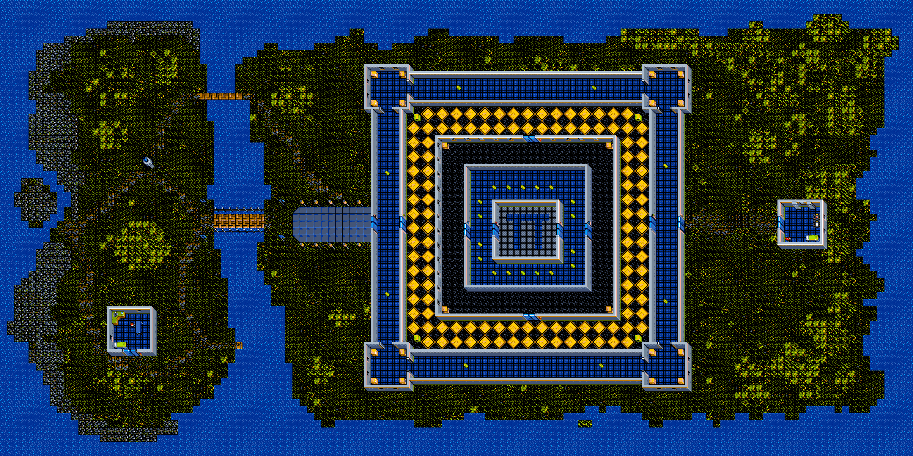

- `level-a.X16`: Test level for the X16 version from the 8-Bit Guy website. Rename the file to `level-a` and copy it in the robots directory.
- `level-a.PET`: Test level for the PET version. Rename the file to `level-a` and copy it to the D64 disk image.
- `level-a.C64`: Test level for the C64 version. Rename the file to `level-a` and copy it to the D64 disk image.
- `level-a.128`: Test level for the C128 version. Rename the file to `level-a-128` and copy it to the D64 disk image.
- `level-a.AMIGA`: Test level for the Amiga version. Rename the file to `level-a` and copy it to the ADF disk image.
- `level-a.MSD`: Test level for the MS-DOS version. Rename the file to `level-a` and copy it in the robots directory.
- `new-level-a`: A complete new level (made with Tiled). Rename the file related to your system to `level-a` and copy it in the robots directory.
  
    
  
- **Warning:** Existing level-a will be overwritten!
